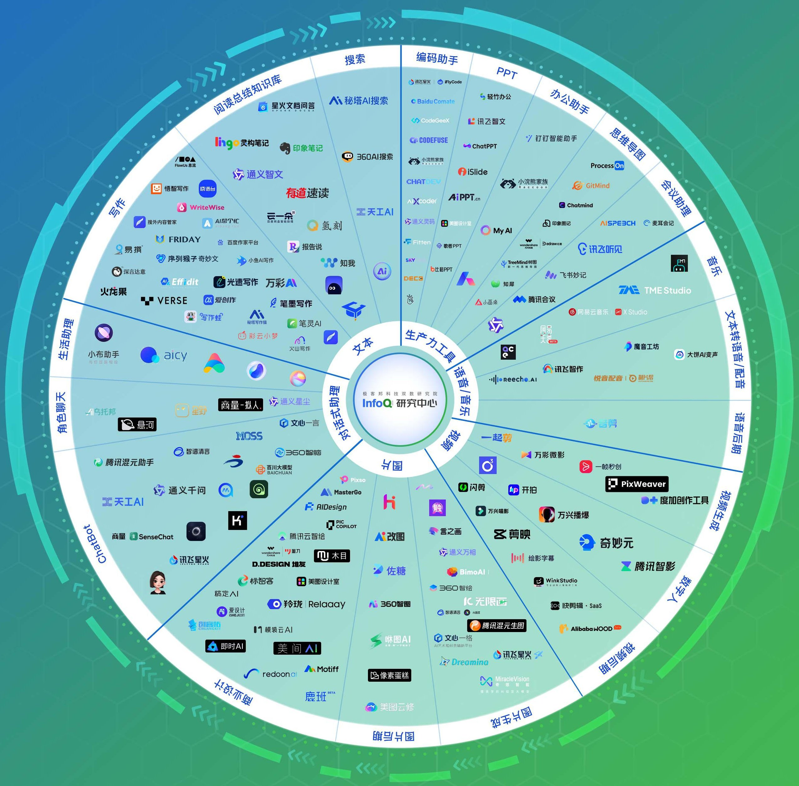

# Awesome AI Applications 

**Note the Awesome AI Applications**

---

## Table of Contents

- [Awesome AI Applications ](#awesome-ai-applications-)
  - [Table of Contents](#table-of-contents)
- [GeoSpy - AI Powered Image Geo-Location Tool](#geospy---ai-powered-image-geo-location-tool)
- [InfoQ - Chinese Large Model Product Landscape](#infoq---chinese-large-model-product-landscape)

---

# GeoSpy - AI Powered Image Geo-Location Tool

[GeoSpy.ai](https://geospy.web.app/)

Darg the Image to Upload

Location is not precise enough 😂

Just for fun (from my perspective) 🫣

---

# InfoQ - Chinese Large Model Product Landscape

[大模型产品全景盘点](https://www.infoq.cn/article/aXRQ3sGf6eOG3GiJqWHY)

[中国大模型产品罗盘 - InfoQ](https://www.infoq.cn/minibook/YRh7eroQ34b8d49Oy1si)

[中国大模型产品罗盘 - PDF](/Docs/InfoQ/中国大模型产品罗盘.pdf)

